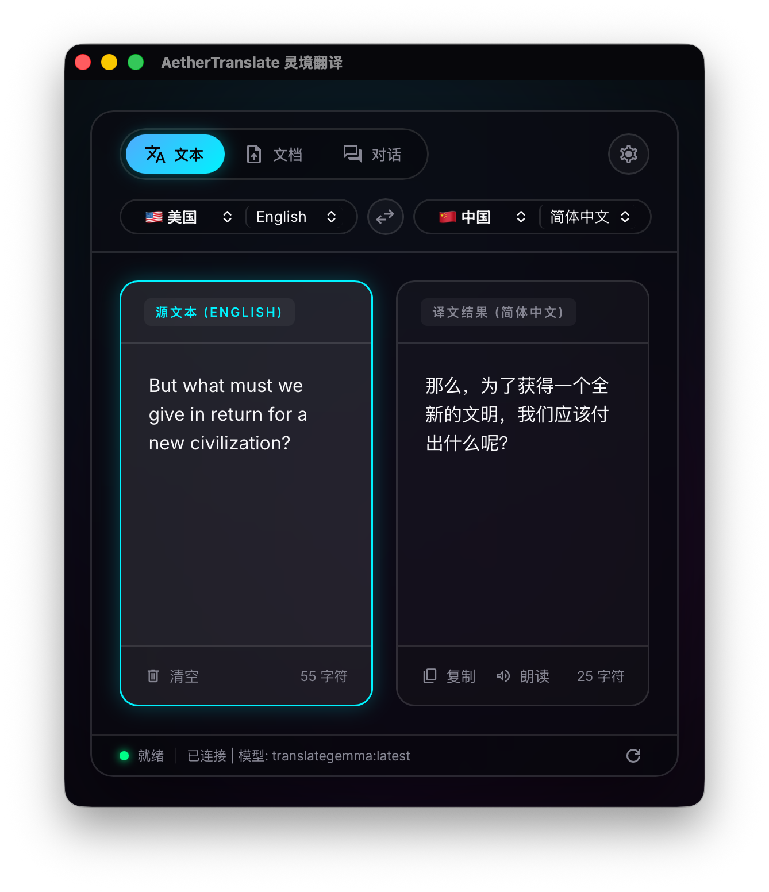

# AetherTranslate 灵境翻译



AetherTranslate 灵境翻译是一款基于 **Tauri v2 + SolidJS + Rust + Ollama** 构建的完全离线/本地化智能翻译桌面终端。

## 🌟 核心特性
- **本地多语言翻译**：基于本地 Ollama 推理模型进行高质量翻译，支持多语言智能段落拆解与协同翻译。
- **对话学习流**：提供沉浸式多语言口语对话练习，支持语法纠错与双语对照展示。
- **文档智能解析**：支持 TXT、MD、DOCX (Word) 文档的解析、段落切割翻译及导出。
- **高颜值毛玻璃 UI**：内置赛博毛玻璃 (Cyber)、复古温暖 (Gruvbox) 和东京之夜 (Tokyo Night) 三款高颜值主题。
- **系统离线 TTS**：无缝对接本地系统语音节点进行口语发音朗读。
- **安全性沙箱**：内置严格的内容安全策略 (CSP) 与路径安全沙箱 (限制在用户主目录下操作)，杜绝路径穿越及 SSRF 风险。

---

## 🛠️ 开发与编译指南

### 1. 前置依赖准备
确保您的开发机已经配置好以下环境：
- **Node.js**：建议使用 v18 或更高版本。
- **Rust Toolchain**：Tauri 需要 Rust 编译器。请前往 [rustup.rs](https://rustup.rs/) 安装。
- **Ollama**：请确保已在本地安装并启动了 [Ollama](https://ollama.com/) 服务（默认端口 `11434`）。
  - *建议下载翻译优化模型*：如 `translategemma` 等。

---

### 2. 初始化项目
在项目根目录下执行以下命令安装前端依赖：
```bash
npm install
```

---

### 3. 开发模式运行
启动本地开发服务器并调起 Tauri 桌面窗口：
```bash
npm run tauri dev
```
此命令会同时启动 Vite 前端开发服务与 Rust 后端，支持热重载 (Hot Reload) 和实时调试。

---

### 4. 编译出可安装的版本 (Release 打包)
要构建生产环境高度优化的本地可安装安装包，请运行：
```bash
npm run tauri build
```

编译完成后，Tauri 会根据您的当前操作系统在以下目录生成安装包：
- **macOS**: `src-tauri/target/release/bundle/dmg/` (生成 `.dmg` 安装包) 或 `src-tauri/target/release/bundle/macos/` (生成绿色版 `.app` 程序)
- **Windows**: `src-tauri/target/release/bundle/msi/` (生成 `.msi` 安装包) 或 `src-tauri/target/release/bundle/nsis/` (生成 `.exe` 安装程序)
- **Linux**: `src-tauri/target/release/bundle/deb/` 或 `src-tauri/target/release/bundle/appimage/`

---

## 🔒 安全审计声明
本项目在架构上做出了严格的安全兜底：
1. **SSRF 阻断**：后端采用安全托管状态绑定 `Ollama` URL 并限制仅连接 `localhost` 域，防止向内网其他敏感端点发送请求。
2. **目录沙箱化**：本地解析和写入命令（如 `parse_file`、`write_file`）均经由严格的符号链接解析校验，仅允许在当前用户的 **Home 主目录** 内读写，杜绝了路径穿越漏洞。
3. **安全内容策略**：启用了严格的 CSP 规则，默认屏蔽所有外链脚本的注入，仅允许指定的可信字体及本地打包资产。
